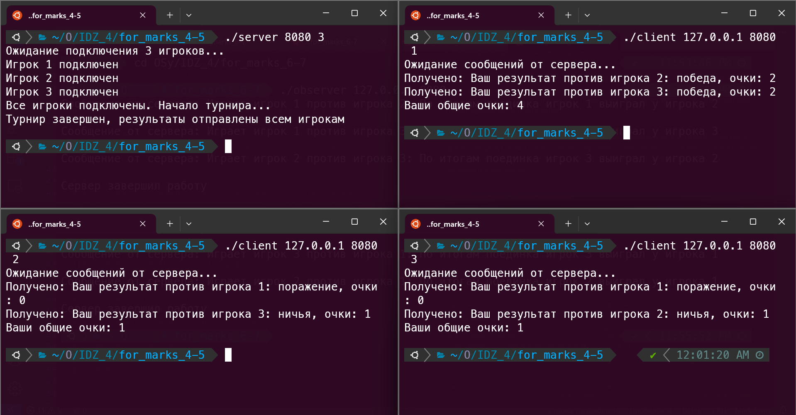
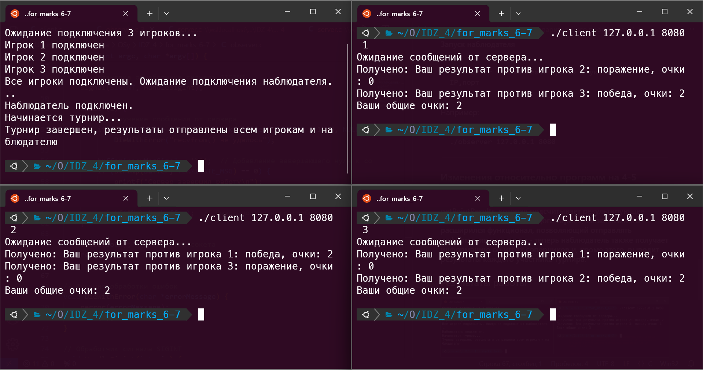
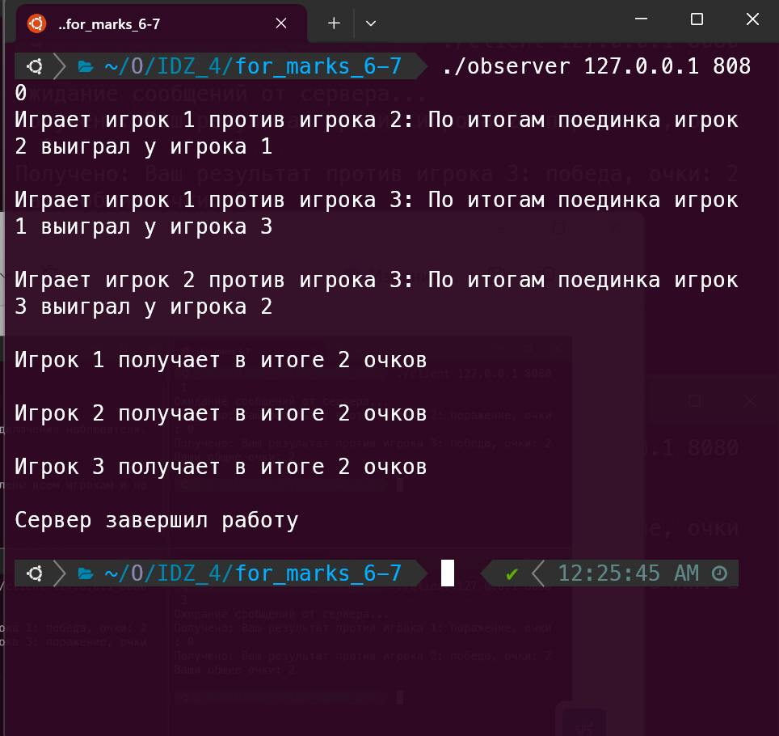

# Индивидуальное домашнее задание № 4
## __Кухтина Юлия Егоровна, БПИ224__
## Вариант № 35
### «Камень, ножницы, бумага» 1 — однокруговая система. N cтудентов, изнывающих от скуки на лекции по операционным системам решили организовать однокруговой турнир в игру «Камень, ножницы, бумага». Каждый с каждым при этом играет только один раз. За победу дается два очка, за ничью — одно, за поражение — ноль. 
### Требуется создать клиент–серверное приложение, моделирующее турнир. Каждый студент — отдельный клиент. Генерация камня, ножниц и бумаги в каждом поединке формируется сервером случайно. 
### Завершение работы программ осуществляется по завершению турнира. Количество участвующих студентов задается сервером.

## Отчет

## Требования на 4-5 баллов
### Запуск программы
#### Компиляция сервера и клиента
```
gcc server.c -o server
gcc client.c -o client
```

#### Запуск сервера
```
./server <port> <players number> # указываем порт и количество игроков турнира
```
Например:
```
./server 8080 3
```

#### Запуск клиентов
#### Для корректной работы приложения необходимо запустить столько клиентов, сколько указано в параметрах сервера
```
./client <IP address> <port> <player number> # указываем IP,порт и номер игрока турнира
```
Например:
```
./client 127.0.0.1 8080 1
./client 127.0.0.1 8080 2
./client 127.0.0.1 8080 3
```

### Сценарий решаемой задачи
#### Сервер - это условная площадка для проведения турнира. Сначала мы запускаем сервер и начинаем ждать игроков. Каждый новый игрок - это новый клиент. Сервер ожидает, пока наберется столько игроков, сколько было заявлено изначально.
#### После того, как все клиенты подключились, эмулируется процесс игры в функции playGame(), в которой случайно заполняется таблица результатов поединков. Далее результаты об играх передаются в клиентов, где выводятся на экран.

### Завершение программы
#### Программа завершается в соответствии с условием задачи по окончании "объявления" результатов в клиентах, либо при принудительном прерывании с помощью Ctrl + C. В обоих случаях реализовано корректное завершение программы

### Результаты работы



## Требования на 6-7 баллов
### Запуск программы
#### Компиляция сервера, клиента, наблюдателя
```
gcc server.c -o server
gcc client.c -o client
gcc observer.c -o observer
```

#### Запуск сервера
```
./server <port> <players number> # указываем порт и количество игроков турнира
```
Например:
```
./server 8080 3
```

#### Запуск клиентов
#### Для корректной работы приложения необходимо запустить столько клиентов, сколько указано в параметрах сервера
```
./client <IP address> <port> <player number> # указываем IP,порт и номер игрока турнира
```
Например:
```
./client 127.0.0.1 8080 1
./client 127.0.0.1 8080 2
./client 127.0.0.1 8080 3
```
#### Запуск наблюдателя
```
./observer <IP address> <port> # указываем IP,порт
```
Например:
```
./observer 127.0.0.1 8080
```


### Изменения относительно программ на 4-5
#### Клиент не изменился. В сервере добавилась функция getPointResults, которая подсчитывает результирующее количество очков для каждого игрока, также немного расширился функционал, позволяющий отправлять информацию клиентам - теперь наблюдатель также получает информацию об играх соперников и, кроме этого, выводит результаты каждого участника турнира.

### Результаты работы

